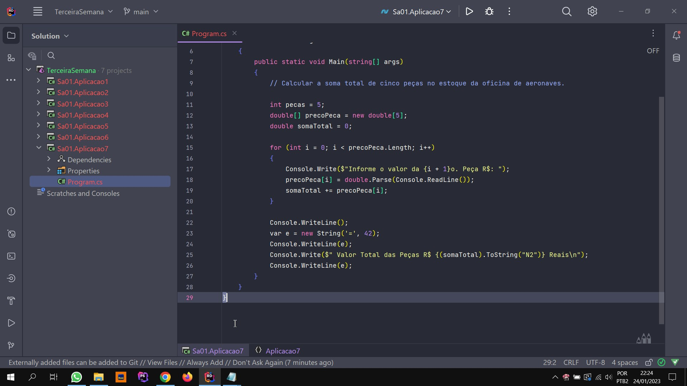

<h1 align="center"> Desafio C# Senai </h1>

DESAFIO: Crie um repositório no GitHub com o nome sa01-seunome, e envie uma solução com
7(sete) projetos Console Aplication.  

  <a href="#-tecnologias">Tecnologias</a>&nbsp;&nbsp;&nbsp;|&nbsp;&nbsp;&nbsp;
  <a href="#-projeto">Projeto</a>&nbsp;&nbsp;&nbsp;|&nbsp;&nbsp;  &nbsp;
  <a href="#memo-licença">Licença</a>

  

 

  

## 🚀 Tecnologias

Esse projeto foi desenvolvido com as seguintes tecnologias:

- C#
- Git e Github

## 💻 Projeto

Projetos com Console Aplication utilizando a IDE Rider JetBrains.

## 📜  Licença

Esse projeto está sob a licença MIT.

---

Feito por Márcio Aquilles.